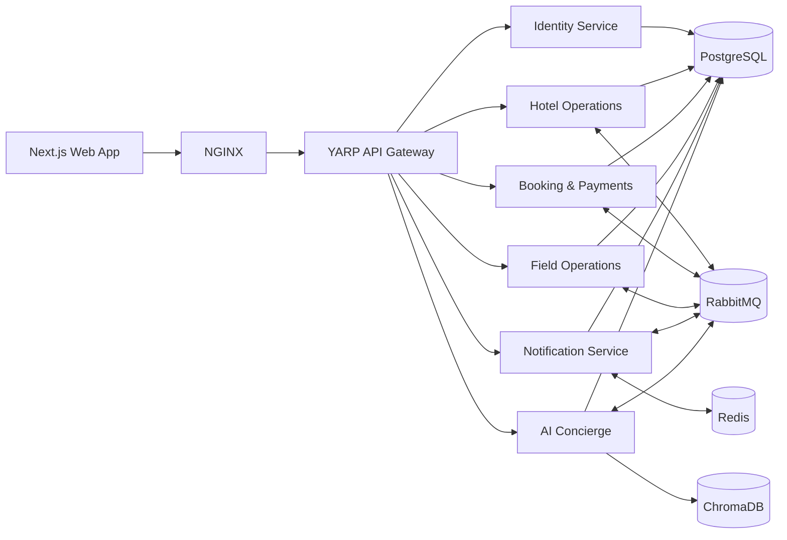

# SmartHotel

SmartHotel is a cloud-ready hotel property management platform that connects guest booking, hotel operations, field staff, notifications, payments, and an AI concierge through a distributed microservice architecture.

The platform provides role-based portals for guests and hotel employees, real-time operational updates, event-driven workflows, secure authentication, and infrastructure definitions for local development and cloud deployment.

## Key Features

- Guest registration, authentication, profile management, and passwordless magic-link flows
- Room inventory, room types, availability, housekeeping, and maintenance workflows
- Booking lifecycle and payment processing with sandbox support
- Role-based access control for hotel owners, managers, receptionists, and operational staff
- Real-time notifications and chat using SignalR and Redis
- Event-driven communication between services using RabbitMQ
- AI concierge with guarded prompts, conversation persistence, and retrieval-augmented responses
- Central API routing, JWT validation, and rate limiting through a YARP gateway
- Docker Compose, Kubernetes, Terraform, and Jenkins deployment assets
- Unit, integration, and end-to-end test suites

## Architecture



## Services

| Component | Technology | Default port | Purpose |
| --- | --- | ---: | --- |
| Frontend | Next.js 16, React 19, TypeScript | 3000 | Guest and employee portals |
| API Gateway | ASP.NET Core 8, YARP | 5000 | Routing, authentication, and rate limiting |
| Identity | ASP.NET Core 8 | 5001 | Authentication, users, roles, and JWT/JWKS |
| Hotel Operations | ASP.NET Core 8 | 5002 / 5012 | Rooms, inventory, housekeeping, and gRPC |
| Booking & Payments | ASP.NET Core 8 | 5003 / 5013 | Reservations, payments, and gRPC |
| Notifications | ASP.NET Core 8, SignalR | 5004 | Notifications, alerts, and chat |
| AI Concierge | Python, FastAPI | 5005 | Conversational assistance and RAG |
| Field Operations | Java 21, Spring Boot 3 | 8084 | Staff tasks and operational workflows |
| RabbitMQ | RabbitMQ 3 | 5672 / 15672 | Events and management UI |
| PostgreSQL | PostgreSQL 16 | 5432 | Service data stores |
| Redis | Redis 7 | 6379 | Cache and SignalR backplane |
| NGINX | NGINX | 80 / 443 | TLS termination and external reverse proxy |

## Technology Stack

- **Frontend:** Next.js, React, TypeScript, Tailwind CSS, Zustand, TanStack Query, Radix UI
- **Backend:** ASP.NET Core, Entity Framework Core, Clean Architecture, CQRS/MediatR, Java Spring Boot, FastAPI
- **Communication:** REST, gRPC, RabbitMQ, SignalR WebSockets
- **Data:** PostgreSQL, Redis, ChromaDB
- **Security:** JWT, JWKS, role-based authorization, API keys, rate limiting
- **Infrastructure:** Docker Compose, Kubernetes, Terraform, NGINX, Jenkins
- **Testing:** xUnit, pytest, Maven tests, Playwright

## Repository Structure

```text
.
|-- frontend/                         # Next.js application
|-- gateway/                          # YARP API gateway
|-- services/
|   |-- identity-service/             # Authentication and authorization
|   |-- hotel-ops-service/            # Hotel inventory and operations
|   |-- booking-payments-service/     # Booking and payment workflows
|   |-- field-ops-service/            # Java field operations service
|   |-- notification-service/         # SignalR notifications and chat
|   `-- ai-concierge-service/         # FastAPI AI concierge
|-- shared/                           # Shared authorization and protobuf contracts
|-- tests/                            # Cross-service and gateway tests
|-- infra/
|   |-- docker-compose.yml            # Local container stack
|   |-- kubernetes/                   # Kubernetes manifests and overlays
|   |-- terraform/                    # Cloud infrastructure
|   `-- nginx/                        # Edge proxy configuration
|-- ci/                               # Build, scan, push, and deployment scripts
|-- docs/                             # Technical and verification reports
|-- Jenkinsfile                       # CI/CD pipeline
`-- run-all.ps1                       # Native Windows development runner
```

## Quick Start with Docker

### Prerequisites

- Git
- Docker Desktop with Docker Compose
- At least 8 GB of available memory is recommended for the complete stack

### 1. Clone the repository

```bash
git clone https://github.com/pirathee587/Smart-hotel.git
cd Smart-hotel
```

### 2. Configure the environment

Copy the example environment file and replace the placeholder values with local development credentials.

PowerShell:

```powershell
Copy-Item .env.example .env
```

Bash:

```bash
cp .env.example .env
```

At minimum, review the PostgreSQL, RabbitMQ, Redis, hotel-operations API key, biometric device API key, and PayHere sandbox variables. Never commit the resulting `.env` file.

### 3. Start the platform

```bash
docker compose --env-file .env -f infra/docker-compose.yml up --build -d
```

Check container health and logs:

```bash
docker compose --env-file .env -f infra/docker-compose.yml ps
docker compose --env-file .env -f infra/docker-compose.yml logs -f
```

### 4. Open the application

- Frontend: <http://localhost:3000>
- API Gateway: <http://localhost:5000>
- Identity Swagger: <http://localhost:5001/swagger>
- Hotel Operations Swagger: <http://localhost:5002/swagger>
- Booking Swagger: <http://localhost:5003/swagger>
- Notification Swagger: <http://localhost:5004/swagger>
- AI Concierge docs: <http://localhost:5005/docs>
- RabbitMQ management: <http://localhost:15672>

### 5. Stop the platform

```bash
docker compose --env-file .env -f infra/docker-compose.yml down
```

Add `-v` only when you intentionally want to delete local database volumes.

## Native Windows Development

The included runner starts the .NET services, Python concierge, gateway, and frontend directly on Windows.

Required runtimes:

- .NET 8 SDK
- Node.js 22 and npm
- Python 3.11 or newer
- Java 21 and Maven for the Field Operations service
- Locally available PostgreSQL, RabbitMQ, and Redis dependencies

Install frontend and concierge dependencies first:

```powershell
npm --prefix frontend install
python -m pip install -r services/ai-concierge-service/smarthotel-concierge/requirements.txt
```

Start or stop the application:

```powershell
.\run-all.ps1
.\run-all.ps1 -Stop
```

> `run-all.ps1` currently contains a workstation-specific workspace path. Update `$WorkspaceRoot` if the repository is cloned elsewhere.

## Testing

Run the relevant suite from the repository root.

```powershell
# .NET service and gateway tests
dotnet test services/identity-service/SmartHotel.Identity/SmartHotel.Identity.sln
dotnet test services/hotel-ops-service/SmartHotel.HotelOps/SmartHotel.HotelOps.sln
dotnet test services/booking-payments-service/SmartHotel.Booking/SmartHotel.Booking.sln
dotnet test services/notification-service/SmartHotel.Notifications/SmartHotel.Notifications.sln
dotnet test tests/SmartHotel.Gateway.IntegrationTests/SmartHotel.Gateway.IntegrationTests.csproj

# AI Concierge tests
python -m pytest services/ai-concierge-service/smarthotel-concierge/tests

# Field Operations tests
mvn -f services/field-ops-service/smarthotel-fieldops/pom.xml test

# Frontend lint and end-to-end tests
npm --prefix frontend run lint
npm --prefix frontend run test:e2e
```

Playwright may require browser installation before the first end-to-end test run:

```bash
cd frontend
npx playwright install
```

## Infrastructure and Deployment

- Docker configuration is located in `infra/docker-compose.yml`.
- Kubernetes base manifests and the staging overlay are under `infra/kubernetes/`.
- Reusable Terraform modules and environments are under `infra/terraform/`.
- CI/CD automation is defined by `Jenkinsfile` and scripts in `ci/`.

Terraform-generated files must remain local. The `.terraform/` directory and state files are ignored by Git; providers can always be restored with `terraform init`.

Example staging initialization:

```bash
cd infra/terraform/environments/staging
cp backend.hcl.example backend.hcl
cp terraform.tfvars.example terraform.tfvars
terraform init -backend-config=backend.hcl
terraform plan
```

Do not commit `backend.hcl`, `terraform.tfvars`, Terraform state, credentials, private keys, or generated provider binaries.

## Security Notes

- Use development-only credentials locally and rotate any exposed secrets immediately.
- Keep `.env`, Terraform variable files, certificates, and cloud credentials out of source control.
- Use the payment sandbox in non-production environments.
- Review example Kubernetes secrets before deployment and provide secrets through an approved secret manager.

## Documentation

Implementation audits, readiness reports, workflow reports, and security reviews are available in the [`docs`](docs/) directory.

## License

No license file is currently included. Add a license before distributing or reusing this project outside its intended scope.
