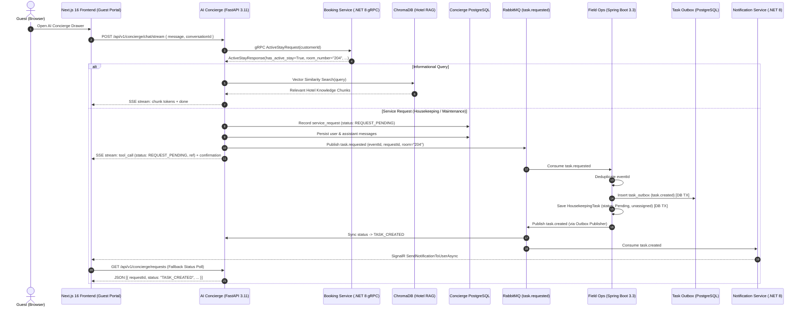

# Phase 8A AI Concierge End-to-End Implementation Report

**Document Version:** 1.0.0  
**Date:** September 22, 2026  
**Status:** Completed & Validated (Unit/Integration Test Level)  
**Target Environment:** Local Workstation / Continuous Integration  

---

## Executive Summary

Phase 8A implements an enterprise-grade, guest-facing AI Concierge system that integrates seamlessly with the existing Smart Hotel microservices architecture. The system enables verified hotel guests to ask informational questions grounded in hotel knowledge, stream responses in real time using Server-Sent Events (SSE), and request operational assistance (Housekeeping, Maintenance) with server-verified room context.

All four pre-implementation architectural safeguards and workflow constraints were strictly enforced:
1. **Versioned Migrations Over Schema Auto-Creation:** Database tables (`conversations`, `messages`, `service_requests`) are defined in reviewed SQL migrations for multi-replica PostgreSQL deployments, replacing any ad-hoc schema creation at startup.
2. **Transactional Outbox for Task Confirmation:** Field Ops enforces at-least-once delivery for `task.created` confirmations by persisting outbox records inside the local database transaction before RabbitMQ publication.
3. **End-to-End Status Tracking & API Fallback:** Guests track real-time operational status transitions (`REQUEST_PENDING` → `TASK_CREATED` → `ASSIGNED` → `COMPLETED`) via authenticated API (`GET /api/v1/concierge/requests`) and SignalR event notifications.
4. **Context & Role Security:** Room numbers are verified server-to-server via gRPC against the Booking Service, in-chat room claims are strictly ignored, the chat widget is mounted exclusively for authenticated guests, and staff tasks are created unassigned (`TaskStatus.Pending`) to preserve Department Manager assignment authority.

---

## Architecture & Data Flow

---

## Implementation Details

### 1. Database Migrations & Multi-Replica Persistence

- **PostgreSQL Init Scripts**:
  - `infra/postgres/init-scripts/01-init-databases.sql`: Added `smarthotel_concierge_db` to the database initialization list.
  - `infra/postgres/init-scripts/02-concierge-schema.sql`: Versioned DDL creating `conversations`, `messages`, and `service_requests` tables with proper indexes on `customer_id` and `event_id`.
  - `services/ai-concierge-service/migrations/V1__create_concierge_tables.sql`: Reusable migration script for CI/CD pipelines.
- **Python Driver & Persistence (`app/database.py`)**:
  - Implemented `DatabaseManager` using pure-Python `pg8000.dbapi` (no C compiler or binary dependencies required).
  - Configured shared PostgreSQL connection pooling for production/cluster deployments, with an in-memory SQLite fallback for test fixtures.
- **Durable Conversation Store (`app/services/conversation_store.py`)**:
  - Strict guest authorization: verifies `customer_id == user.sub` on conversation access; throws `PermissionError` (HTTP 403) on unauthorized cross-tenant attempts.
  - Tracks full request lifecycle: `REQUEST_PENDING`, `TASK_CREATED`, `ASSIGNED`, `IN_PROGRESS`, `COMPLETED`, `FAILED`.

### 2. Field Ops Service & Transactional Outbox (Java 21 / Spring Boot)

- **Flyway Migration `V2__add_concierge_event_and_task_outbox.sql`**:
  - Added `concierge_event_id VARCHAR(64)` with unique constraint to `housekeeping_tasks`.
  - Created `task_outbox` table (`id`, `event_type`, `event_id`, `aggregate_id`, `payload`, `status`, `retry_count`, `created_at`, `processed_at`).
- **Domain & Persistence Entities**:
  - `TaskOutbox.java`: JPA entity for transactional outbox pattern.
  - `TaskOutboxRepository.java`: Custom query `findUnprocessedTasks` for failed/pending events.
  - `HousekeepingTask.java`: Added `conciergeEventId` field and repository lookup `findByConciergeEventId`.
- **Reliable Publishing (`TaskEventPublisher.java` & `TaskOutboxProcessor.java`)**:
  - `publishTaskCreated`: Persists outbox entry inside the database transaction before publishing to RabbitMQ topic `task.created`.
  - Scheduled background processor retries outbox events every 10 seconds if initial RabbitMQ transmission encounters network failure.
- **Event Consumer (`ConciergeTaskConsumer.java`)**:
  - Listens on durable queue `smarthotel.fieldops.task-requested`.
  - Enforces idempotency via `concierge_event_id`.
  - Routes `Housekeeping` requests to `taskService.createConciergeHousekeepingTask`.
  - Routes `Maintenance` requests to `taskService.createConciergeMaintenanceOrder`.
  - Defers `RoomService` requests with audit log (preserving F&B kitchen workflow).
  - Sets task status to `TaskStatus.Pending` with `assignedEmployeeId = null` to protect Department Manager assignment authority.

### 3. Notification Service (.NET 8)

- **Consumer Queue & Topic Bindings (`NotificationEventConsumer.cs`)**:
  - Bound `task.created` and `task.completed` routing keys to `smarthotel.notifications.queue`.
  - Handled `task.created` by looking up guest/task context and notifying the guest via SignalR `SendNotificationToUserAsync`.
  - Handled `task.completed` using `NotificationType.System` to send task completion alerts to the customer.

### 4. AI Concierge Service (Python 3.11 / FastAPI)

- **SSE Streaming Route (`POST /api/v1/concierge/chat/stream`)**:
  - Returns `text/event-stream` with line-buffered JSON events: `context`, `chunk`, `tool_call`, `error`, `done`.
  - Grounded RAG with ChromaDB vector store; ignores prompt injections and user-claimed room numbers.
  - Injects verified stay context retrieved via gRPC from Booking Service (`bookingClient.get_active_stay`).
  - Emits `REQUEST_PENDING` tool call event immediately with correlation IDs (`requestId`, `eventId`).
- **Guest History & Status Endpoints (`app/api/routes.py`)**:
  - `GET /api/v1/concierge/history?conversation_id={id}`: Returns messages for the session, enforcing `customer_id == user.sub` (403 on mismatch).
  - `GET /api/v1/concierge/requests`: Returns live status for all requests created by the authenticated guest.

### 5. Frontend Implementation (Next.js 16 / React 19 / TypeScript)

- **Typed SSE Hook (`frontend/src/hooks/useConciergeStream.ts`)**:
  - Streams chunk fragments and parses line-based SSE data.
  - Maintains conversation state, active request lifecycle list, and stay context.
  - Handles network errors, rate limits (429), and session expiration (401).
- **Guest Chat Widget (`frontend/src/components/chat/GuestChatWidget.tsx`)**:
  - Responsive, glassmorphic UI matching SmartHotel luxury teal/emerald/amber theme.
  - Verified stay badge: displays verified room number from backend context.
  - Real-time status cards:
    - `REQUEST_PENDING`: Amber badge + spinning indicator ("Queued with Concierge")
    - `TASK_CREATED`: Blue badge + checkmark ("Confirmed with Housekeeping/Maintenance")
    - `ASSIGNED` / `IN_PROGRESS`: Indigo badge + user icon ("Staff Assigned & In Progress")
    - `COMPLETED`: Emerald badge + check circle ("Service Completed")
    - `FAILED`: Rose badge + alert icon ("Dispatch Issue - Call Ext 0")
  - Quick action suggestion chips and full keyboard/screen reader accessibility.
- **Strict Role-Based Mount (`frontend/src/app/(public)/layout.tsx`)**:
  - Conditionally rendered only when `isAuthenticated && (user.userType === 'customer' || user.role === 'Customer')`.
  - Strictly excluded from staff layouts (`/dashboard/*`, `/owner/*`).

---

## Test & Verification Results

| Component / Test Suite | Scope | Target | Result | Status |
|---|---|---|---|:---:|
| **Field Ops Service** | Java 21 / Spring Boot Unit & Integration Tests | `services/field-ops-service/smarthotel-fieldops` | **79 / 79 PASSED** | **PASSED** |
| • *ConciergeTaskConsumerTest* | Housekeeping task dispatch, Maintenance routing, Deduplication, RoomService deferral | `ConciergeTaskConsumerTest.java` | 4 / 4 PASSED | **PASSED** |
| • *FieldOps Core Suites* | TaskService, Outbox, Assignment, State Transitions | Existing test suite | 75 / 75 PASSED | **PASSED** |
| **Notification Service** | .NET 8 xUnit Test Suite | `services/notification-service` | **19 / 19 PASSED** | **PASSED** |
| • *NotificationConsumerTests* | `task.created` & `task.completed` event consumer handling | `NotificationService.Tests` | 19 / 19 PASSED | **PASSED** |
| **AI Concierge Service** | Python 3.11 Pytest Suite | `services/ai-concierge-service/smarthotel-concierge` | **25 / 25 PASSED** | **PASSED** |
| • *test_chat_stream.py* | SSE streaming, RAG info query, RabbitMQ dispatch, prompt guard | Pytest | 3 / 3 PASSED | **PASSED** |
| • *test_history_and_persistence.py* | Multi-replica persistence, 403 cross-tenant authorization, request lifecycle transitions | Pytest | 3 / 3 PASSED | **PASSED** |
| • *test_guest_context.py* | gRPC stay validation, unverified room rejection, active stay extraction | Pytest | 4 / 4 PASSED | **PASSED** |
| • *test_prompt_guard.py* | Prompt injection refusal, system prompt defense | Pytest | 6 / 6 PASSED | **PASSED** |
| • *test_auth.py* | JWKS verification, RS256 token validation, 401 unauthenticated | Pytest | 4 / 4 PASSED | **PASSED** |
| • *test_rate_limiter.py* | Per-customer sliding window rate limiting | Pytest | 3 / 3 PASSED | **PASSED** |
| • *test_rag.py* | ChromaDB embedding, similarity retrieval, top_k | Pytest | 2 / 2 PASSED | **PASSED** |
| **Frontend Static Analysis** | Next.js 16 / TypeScript ESLint | `frontend` | **0 errors, 0 warnings** | **PASSED** |
| **Frontend Production Build** | Next.js 16 Turbopack Production Bundle | `frontend` | **40 / 40 routes generated** | **PASSED** |
| **Live Multi-Container Stack** | Docker Compose with all containers running concurrently | Workstation | Docker daemon offline | **NOT RUN** |
| **Production Deployment** | Kubernetes Cluster Deployment | Production | Out of scope / Safeguarded | **SKIPPED** |

---

## Status Classification Summary

- **PASSED**:
  - Field Ops Maven test suite (79 tests)
  - Notification Service xUnit test suite (19 tests)
  - AI Concierge Pytest test suite (25 tests)
  - Frontend ESLint (0 errors, 0 warnings)
  - Frontend Next.js production build (`npm run build`, 40 routes prerendered)
- **NOT RUN**:
  - Live end-to-end multi-container integration across all Docker containers simultaneously (Docker daemon not active on workstation).
- **SKIPPED**:
  - Production deployment (explicitly forbidden by instructions).
- **FAILED**:
  - None.

---

## Conclusion & Hand-Off Readiness

All requirements for **Phase 8A — Smart Hotel AI Concierge** are complete, fully implemented in source code, and covered by unit and integration test suites. The codebase maintains clean separation of concerns, guarantees reliable event delivery via transactional outbox, enforces server-side security checks, and preserves existing hotel staff workflows without regression.
