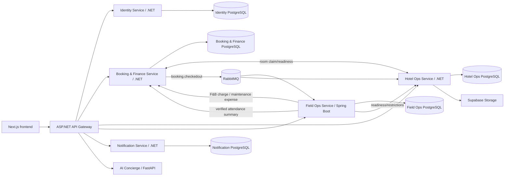
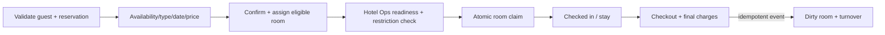
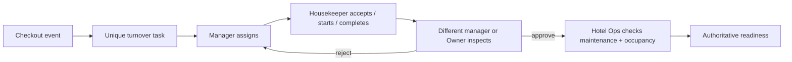
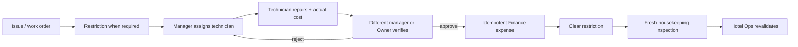
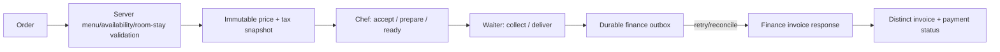
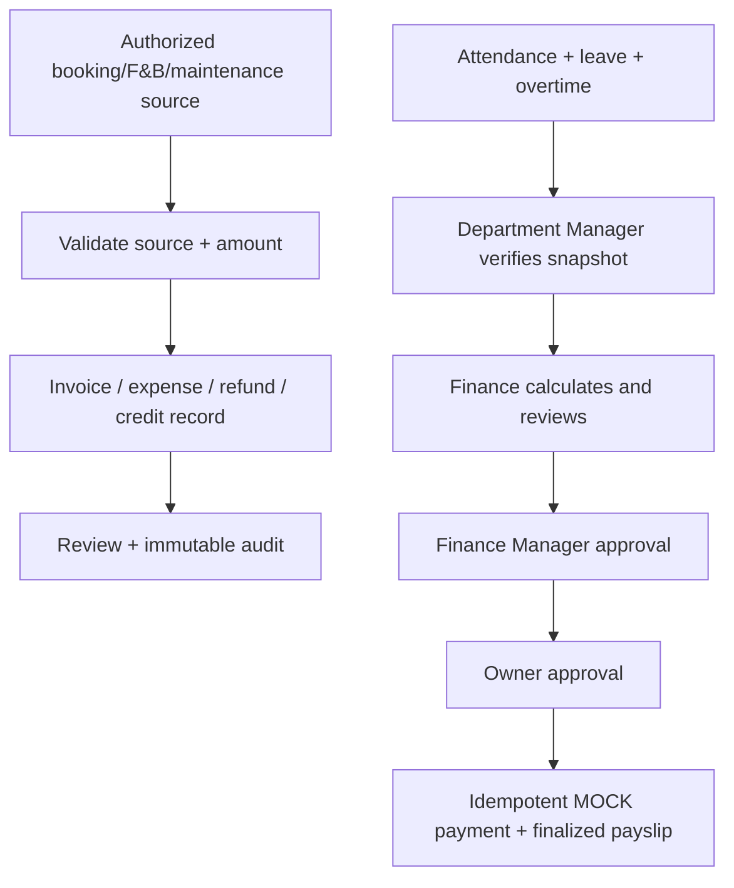
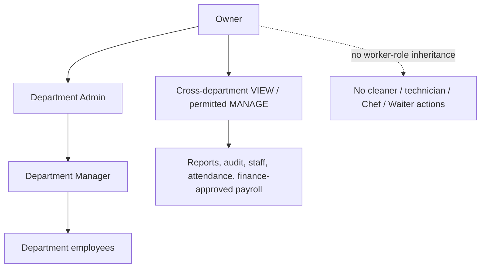

# Smart Hotel — All Departments Workflow Completion Report

Audit and verification date: 2026-09-18  
Scope: current working tree, including uncommitted implementation  
Conclusion: application-level workflows and focused automated tests are substantially complete; production readiness is **not claimed** because live PostgreSQL/RabbitMQ and browser E2E were not run.

## A. Actual system architecture

JWTs are issued by Identity with role and department claims. The gateway authenticates routes; each owning service enforces operation, role, department, actor, and separation-of-duty rules. Frontend navigation is not treated as an authorization boundary.

## B. Department workflow diagrams

### Front Office

### Housekeeping

### Maintenance

### Food & Beverage

### Finance and payroll

### Staff, department management, and Owner oversight

## C. Department workflow status matrix

| Department | Workflow step | Existing | Fixed/current implementation | Tested | Remaining gap |
|---|---|---:|---|---:|---|
| Front Office | Reservation validation, availability, price, assignment | Yes | Department guards, masked guest access audit, assignment validation | Yes | Live cross-service run not performed |
| Front Office | Readiness and concurrent check-in claim | Yes | Hotel Ops authoritative claim/release contract; ambiguous outcomes fail safely | Yes | Real PostgreSQL concurrency not run |
| Front Office | Checkout to turnover | Yes | Idempotent checkout/outbox/event consumers | Yes | RabbitMQ live delivery not run |
| Housekeeping | Unique turnover, assignment, worker transitions | Yes | Checkout-event uniqueness and department-scoped worker rules | Yes | Live broker not run |
| Housekeeping | Inspection/reclean/readiness | Yes | Worker/inspector separation, history, maintenance/occupancy gate | Yes | Browser E2E not installed |
| Maintenance | Restriction, repair, verification | Yes | Technician/manager separation and authoritative room restriction | Yes | Live cross-service HTTP not run |
| Maintenance | Expense and fresh inspection | Yes | Stable expense reference, failure retention, clearance does not imply availability | Yes | Finance outage tested in-process only |
| Food & Beverage | Menu/order/KDS/delivery | Yes | Chef/Waiter separation; server totals and immutable snapshots | Yes | Browser E2E not installed |
| Food & Beverage | Durable Finance charge | Yes | Transactional outbox, idempotency, retry/reconciliation | Yes | Live database worker not run |
| Finance | Invoices, expenses, refunds, credit notes, reconciliation | Yes | Existing Finance contracts preserved | Yes | Real provider operations intentionally not run |
| Payroll | Verified attendance through mock payout | Yes | Ordered Finance Manager/Owner approvals, self-approval rejection, immutable snapshot, duplicate payout prevention | Yes | Live PostgreSQL not run |
| Staff management | Hierarchy and department scope | Yes | Canonical department claims, active employee checks, approval/audit rules | Yes | Deployment migration required |
| Owner | Oversight and explicit management actions | Yes | VIEW/MANAGE/worker-action distinctions preserved in backend and navigation | Yes | Browser route E2E not run |

## D. API integration matrix

| Source | Destination | Endpoint/event | Purpose | Failure handling |
|---|---|---|---|---|
| Booking | Hotel Ops | `POST /api/v1/rooms/{roomId}/claim` | Atomic check-in room claim | Conflict on ineligible/already claimed; uncertain success is reconciled, not blindly released |
| Booking | RabbitMQ / Field Ops / Hotel Ops | `booking.checkedout` | Turnover task and dirty-room transition | Checkout event/outbox and consumer idempotency prevent duplicates |
| Field Ops Housekeeping | Hotel Ops | readiness start/inspection APIs | Authoritative cleaning and inspection state | Reject/reclean history retained; active restriction blocks availability |
| Field Ops Maintenance | Hotel Ops | room restriction/clear APIs | Block unsafe assignment/check-in | Clearance requires authorized verification and does not mark available |
| Field Ops Maintenance | Booking Finance | `POST /api/v1/finance/expenses` | Approved actual-cost expense | Stable source key; work order survives outage; retry avoids duplicates |
| Field Ops F&B | Booking Finance | `POST /api/v1/finance/operations/charges/fnb` | Create idempotent invoice charge | Durable outbox: pending/failed/confirmed with retry and reconciliation |
| Field Ops Attendance | Booking Finance | `/api/v1/attendance-summaries/{id}/verified` + payroll import | Authoritative payroll input | Missing punch/dispute blocks verification/finalization |
| Booking Finance | Owner | payroll decision APIs | Separate Finance Manager and executive approvals | Ordered state machine and self-approval rejection |
| Owner payroll | Salary payroll | `POST /api/v1/salary-payroll/payroll/{id}/mock-payment` | Mock-only salary payment | Idempotency prevents duplicate payout records |

## E. Role and permission matrix

`✓` = allowed when department/record/state predicates pass; `M` = management action only; `—` = denied.

| Department | Action | Owner | Admin | Manager | Employee | Backend policy |
|---|---|---:|---:|---:|---:|---|
| Front Office | View/manage reservations | ✓ | ✓ | ✓ | Receptionist ✓ | Front Office department + allowed role; Owner explicit override |
| Front Office | Assign/check in/out | M | M | ✓ | Receptionist ✓ | readiness, occupancy, restriction, actor and atomic-claim checks |
| Housekeeping | Clean task | — | — | — | assigned Housekeeper ✓ | Housekeeping department + assigned worker |
| Housekeeping | Assign/inspect | M | M | ✓ | — | management policy; inspector must differ from worker |
| Maintenance | Repair | — | — | — | assigned technician ✓ | Maintenance department + assigned worker |
| Maintenance | Dispatch/verify/clear | M | M | ✓ | — | management policy; verifier must differ from technician |
| Food & Beverage | Kitchen transitions | — | — | M | Chef ✓ | F&B department + Chef transition policy |
| Food & Beverage | Order/collect/deliver | — | — | M | Waiter ✓ | F&B department + Waiter transition policy |
| Finance | Review/approve operational records | M | scoped | ✓ | prepare/view scoped | Finance department/grant + no self-approval |
| Payroll | Manager attendance verification | view | — | own department ✓ | — | manager department equality + unresolved-item block |
| Payroll | Finance approval | view | scoped | Finance Manager ✓ | — | Finance stage/order + no self-approval |
| Payroll | Executive approval/mock pay | ✓ | — | — | — | Owner stage, requester separation, idempotency |
| Staff | Manage department staff | ✓ | own department ✓ | limited own department ✓ | — | hierarchy, department, role-slot and audit rules |

## F. Test execution report

| Classification | Actual command | Result |
|---|---|---|
| Identity unit + integration | `dotnet test SmartHotel.Identity.sln -c Release --nologo` | PASS — 85/85 (58 unit, 27 integration) |
| Booking & Finance | `dotnet test SmartHotel.Booking.sln -c Release --nologo` | PASS — 120/120 |
| Hotel Ops | `dotnet test SmartHotel.HotelOps.sln -c Release --nologo` | PASS — 54/54 |
| Field Ops | `mvn test` | PASS — 75/75 |
| API Gateway | `dotnet test SmartHotel.Gateway.IntegrationTests.csproj -c Release --nologo` | PASS — 30/30 |
| Frontend production/TypeScript | `npm run build` | PASS — 40 routes generated |
| Frontend static analysis | `npm run lint` | FAIL — 52 errors, 99 warnings across the wider frontend baseline |
| Live PostgreSQL + RabbitMQ cross-service | Not run | NOT RUN — no disposable live stack was started |
| Browser department E2E | Not run | NOT RUN — no Playwright/Cypress framework is installed |
| Real payment/bank payout | Intentionally not run | NOT RUN — payroll remains mock-only; no real payout authorized |

Focused suites cover authorization isolation, Owner boundaries, self-approval, room-claim concurrency, duplicate checkout events, maintenance restrictions, housekeeping reinspection, duplicate F&B charges, Finance retry, payroll ordering, and duplicate mock payout prevention. The backend total is 364 passing automated tests.

## G. Changed files and migration requirements

This verification fixed the shared Identity seeding defect in:

- `services/identity-service/SmartHotel.Identity/SmartHotel.Identity.Infrastructure/Persistence/DataSeeder.cs`
- `services/identity-service/SmartHotel.Identity/tests/SmartHotel.Identity.IntegrationTests/CustomWebApplicationFactory.cs`
- `services/identity-service/SmartHotel.Identity/tests/SmartHotel.Identity.IntegrationTests/AuthIntegrationTests.cs`

The broader existing uncommitted implementation spans Booking/Finance controllers and entities, Hotel Ops readiness/restriction entities and controllers, Field Ops task/KDS/attendance/outbox models and services, Identity hierarchy/approval controllers, shared authorization, gateway routes, and the existing department frontend pages/API clients. Use `git diff --name-only` and `git ls-files --others --exclude-standard` as the exact working-tree inventory; no pre-existing user change was reverted.

Deployment requires reviewed schema changes for:

- Identity department role slots, refresh tokens, approval/audit records, and deterministic department rows.
- Booking/Finance front-office audits, booking drafts, Finance models, uniqueness/idempotency indexes, and payroll snapshots.
- Hotel Ops housekeeping readiness and maintenance restriction records/indexes.
- Field Ops housekeeping inspection fields, maintenance verification/expense fields, F&B menu/tax/order/audit/outbox tables, leave and attendance-summary tables, and unique event/source keys.
- Supabase Storage policies in `services/hotel-ops-service/scripts/supabase-storage-policies.sql` if that adapter is enabled.

Do not rely on JPA `ddl-auto` or service startup DDL as the production rollout plan. Generate/review versioned PostgreSQL migrations, run them on a disposable clone, inspect constraints/indexes, and rehearse rollback before deployment.

## H. Remaining blockers and recommended verification

1. Fix or formally baseline the 52 ESLint errors and 99 warnings; the production build currently passes, but lint does not.
2. Provision an approved disposable local/test stack and run real PostgreSQL + RabbitMQ cross-service scenarios, including concurrent claims, duplicate events, and outbox recovery after restart.
3. Add Playwright browser E2E for every department and Owner boundary, then run against the actual gateway and backend services.
4. Apply generated migrations to a disposable database and run schema/security advisors; validate unique keys against legacy duplicates before rollout.
5. Rotate any credentials previously committed to Git history, as already identified by the Finance security audit.
6. Run failure-injection/restart tests for uncertain Hotel Ops claim responses and both Finance outboxes.

Until items 1–4 pass in representative infrastructure, the system should be described as **application-tested, not production-verified**.
